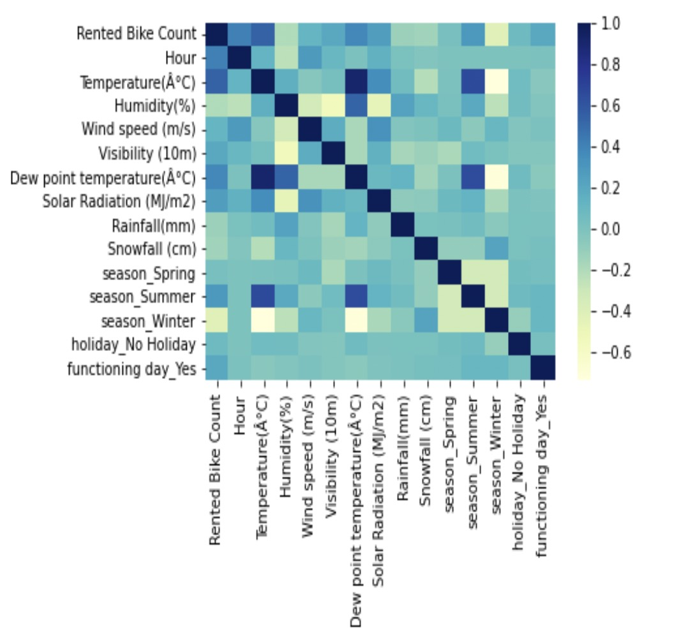
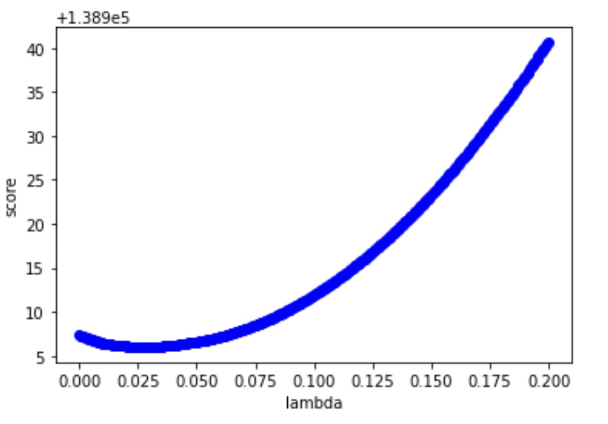
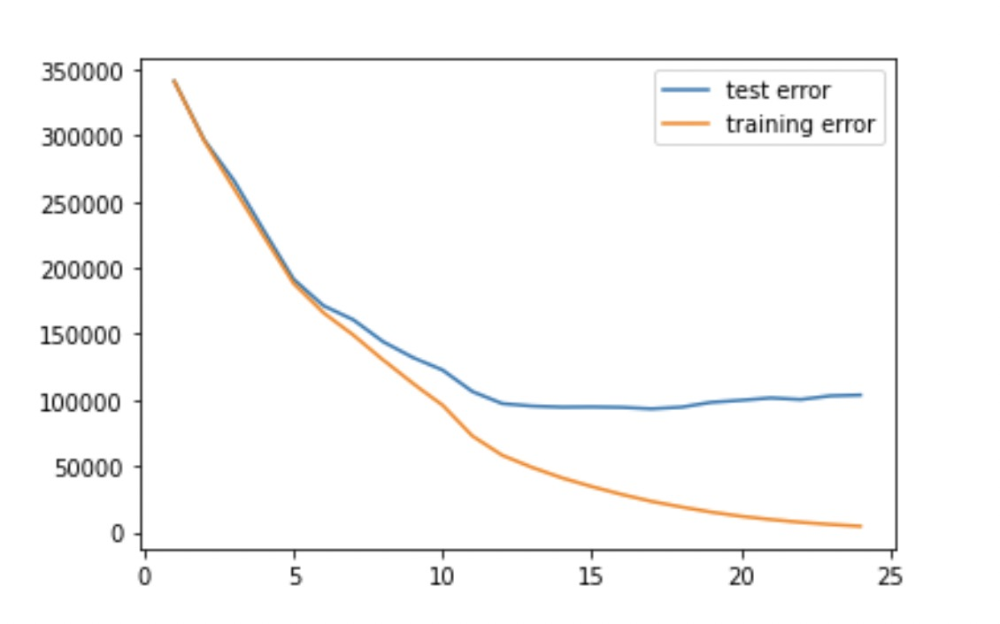
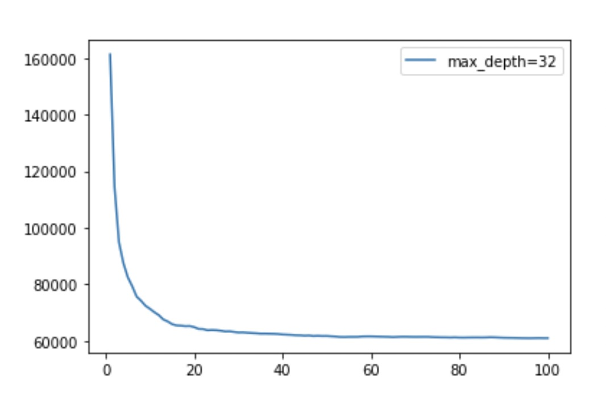
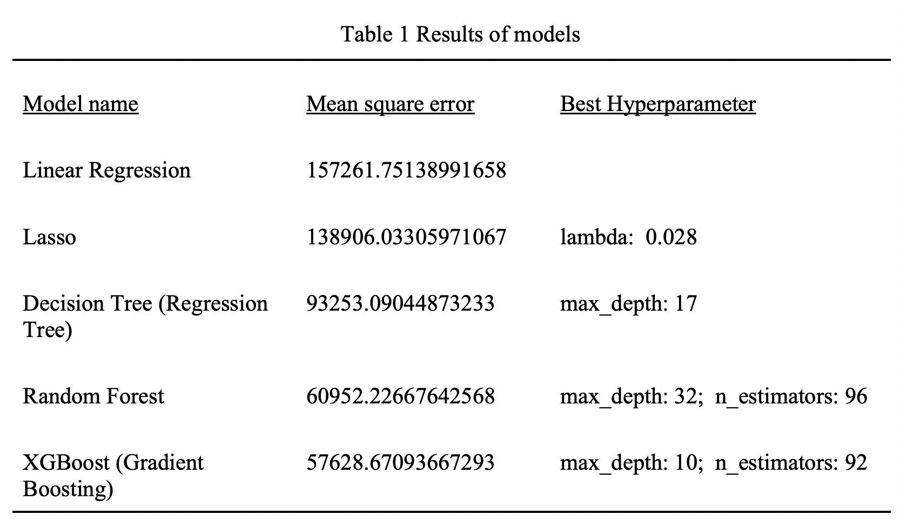

# 570 Final: An Applied Econometric Approach to Predict the Demand of Sharing-Bike

## Data

Our Data Resources is from UCI Machine Learning Repository(URL:https://archive.ics.uci.edu/ml/datasets/Seoul+Bike+Sharing+Demand#). The original resources of this academic dataset is from http://data.seoul.go.kr/, and the holiday information is from SOUTH KOREA PUBLIC HOLIDAYS. (URL: publicholidays.go.kr)

The dataset contains weather information (Temperature, Humidity, Windspeed, Visibility, Dewpoint, Solar radiation, Snowfall, Rainfall), the number of bikes rented per hour and date information. The time span of data collection is from Jan 12, 2017 to Nov 30, 2018.

The concrete attribute information are listed: Date (year-month-day), Rented Bike count (count of bikes rented at each hour),  Hour (hour of he day), Temperature(℃), Humidity(%), Windspeed(m/s), Visibility (10m), Dew point temperature (℃), Solar radiation (MJ/m2), Rainfall(mm), Snowfall(cm), Seasons (winter, spring, summer, autumn), Holiday(holiday/No holiday), Functional Day (NoFunc: Non Functional Hours, Fun: Functional hours).

### Data Processing

In this Part, data is processed in preparation for the next step in the modelling Part. Procedures for processing the data include converting dummy variables, removing collinear variables and segmenting temperature ranges.
1)	Convert to dummy variables:  Convert the categorical variables, including temperature, hour and season.
2)	Drop collinear variables (in linear regression): Owing to multicollinearity, Dew point temperature, season_summer, season_winter, Humidity are dropped when using the Linear Regression model.

3)	Segmenting temperature ranges: To get the temperature more figurative, the study splitted the temperature into 4 segments and converted them to dummy variables, which are renamed by 4 labels, 'cold', 'cool', 'warm' and  'hot'.

## Model 

### Linear Regression

In our linear regression model, there are 34 variables such as Wind speed, Visibility, Solar Radiation ect. to predict Rented Bike Count, the MSE of this model  is 157261.75.

### Lasso

n statistics and machine learning, lasso is a regression analysis method that performs both variable selection and regularization to enhance the prediction accuracy and interpretability of the resulting statistical model. The lambda of min-mse is 0.028, and the min-mse is 138906.

### Decision Tree

In our model, the study continued to use K=10 to identify the cross-validation, a test with the results shown in Figure 5 in Appendix. The mean standard error is equal to 93253.09.

### Random Forest

In our model,  the maximum depth is 32, and the mean standard error is equal to 60952.2.

### XGboost

The results show that the maximum depth is 10 and mean standard error equal to -57628.67. The feature importance also illustrates the feature importance of this model, which shows that humidity has the highest feature importance.

### Comparation

This paper focuses on forecasting the available number of sharing bikes in Seoul using machine learning techniques. Linear Regression, Lasso, Decision Tree, Random Forest and XGboost were used in this paper, and Mean square error is used to compare these models. According to the predicted results, these models all worked well, and XGboost is the best model to forecast the available number of sharing bikes. Previous study shows that XGboost is the best model because it tries to best fit the residual of the last step. So, it can revise some failures in the previous steps. However, the steps are separate in Decision Tree and Random Forest.